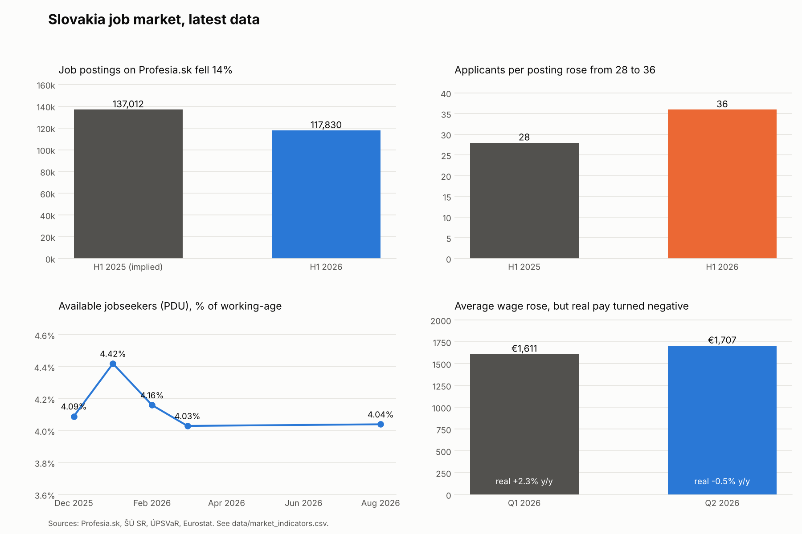
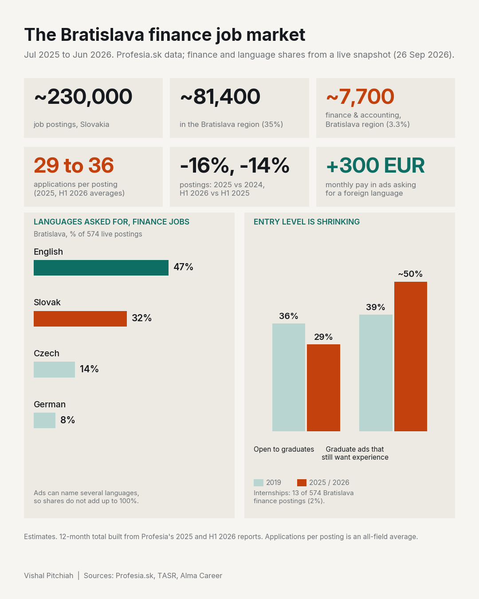

# Slovakia Job Market Tracker

A sourced, regularly updated picture of the Slovak job market: postings, competition per job, unemployment and wages. Every number links to its source, and official Eurostat series refresh automatically each month.

**Live web app:** built in Lovable, see [docs/PLATFORM.md](docs/PLATFORM.md) (features, data sources, rules).

**Last updated: 6 October 2026** (latest official data: unemployment to Aug 2026, wages to Q2 2026, Profesia postings to H1 2026)



## Latest snapshot

<!-- SNAPSHOT:START -->
| Indicator | Latest | Period | Source |
|---|---|---|---|
| Registered unemployment rate | 6.1% | 2026-08 | [IFP flash: flat at 6.1% for 5 months (Apr-Aug 2026)](https://www.teraz.sk/ekonomika/ifp-nezamestnanost-v-auguste-stagnoval/993834-clanok.html) |
| Available jobseekers (PDU) | 4.04% | 2026-08 | [ÚPSVaR via IFP flash (Sep 2026)](https://ifp.sk/nezamestnanost-stagnuje-blizko-historickeho-minima-flash/) |
| Unemployment rate (Labour Force Survey) | 5.6% | 2026-Q2 | [ŠÚ SR, Labour Force Survey (Sep 2026)](https://www.forbes.sk/na-slovensku-pribudaju-ludia-bez-prace-nezamestnanost-vzrastla-na-56-percenta/) |
| Average gross monthly wage | €1,707 | 2026-Q2 | [ŠÚ SR, 2 Sep 2026 (+3.2% nominal, -0.5% real YoY)](https://www.forbes.sk/priemerna-mzda-stupla-na-1707-eur-slovaci-si-vsak-realne-pohorsili/) |
| Real wage growth, year on year | -0.5% | 2026-Q2 | [ŠÚ SR](https://www.forbes.sk/priemerna-mzda-stupla-na-1707-eur-slovaci-si-vsak-realne-pohorsili/) |
| Job postings on Profesia.sk | 117,830 | 2026-H1 | [Profesia H1 2026 report (TASR Jul 2026)](https://www.teraz.sk/ekonomika/pocet-pracovnych-ponuk-na-portali-pr/976382-clanok.html) |
| Profesia postings, year on year | -14% | 2026-H1 | [Profesia H1 2026 report (TASR Jul 2026)](https://www.teraz.sk/ekonomika/pocet-pracovnych-ponuk-na-portali-pr/976382-clanok.html) |
| Applicants per posting | 36 | 2026-H1 | [Profesia H1 2026 report (TASR Jul 2026)](https://www.teraz.sk/ekonomika/pocet-pracovnych-ponuk-na-portali-pr/976382-clanok.html) |
| GDP growth forecast (NBS) | 0.6% | 2026 | [NBS forecast Dec 2025](https://www.tasr.sk/tasr-clanok/TASR:2025122200000343) |
<!-- SNAPSHOT:END -->

The table is regenerated by `src/market_report.py`. Do not edit it by hand.

## What the data says (October 2026)

- **Fewer jobs, more competition.** Profesia.sk postings fell 16% in 2025 and another 14% in H1 2026 (117,830 ads). Each ad now draws 36 applicants on average, up from 28 a year earlier. The Bratislava and Žilina regions saw the steepest drops.
- **Unemployment is flat at a higher level.** Registered unemployment has been 6.1% for five months (Apr to Aug 2026). The Labour Force Survey rate was 5.9% in Q1 and 5.6% in Q2 2026, with 161,900 people unemployed in Q1 (+10.4% year on year). Factory closures pushed up layoffs in July; by August they had fallen to about a sixth of that level, mainly in the Nitra, Galanta, Trnava and Bratislava districts.
- **Pay no longer beats inflation.** The average wage reached €1,707 in Q2 2026. That is +3.2% nominal but −0.5% real, the first real decline after real growth of 2.3% in Q1.
- **Weak growth outlook.** NBS expected only 0.6% GDP growth for 2026 (Dec 2025 forecast).
- **Harder for graduates.** The share of postings open to graduates fell from 36% (2019) to 29% (2025), and about half of those still ask for experience.

**Bratislava finance and accounting (Profesia snapshot, 26 Sep 2026):** about 7,700 postings over 12 months. Of 574 live ads, 47% name English, 32% Slovak, 14% Czech and 8% German.



## Keeping it up to date

| What | How | When |
|---|---|---|
| Eurostat: unemployment (total and under 25), HICP inflation, job vacancy rate | `python src/fetch_eurostat.py` (automatic via GitHub Actions) | 3rd of each month |
| Charts and snapshot table | `python src/market_report.py` (automatic, same workflow) | after each fetch |
| Profesia postings and applicants per ad | add a row to `data/market_indicators.csv` | quarterly reports (Jan, Apr, Jul, Oct) |
| ŠÚ SR wages and LFS unemployment | add a row to `data/market_indicators.csv` | quarterly, about 2 months after quarter end |
| ÚPSVaR registered unemployment | add a row to `data/market_indicators.csv` | around the 20th of each month |

**Due next:** Profesia Q3 2026 report (October), ÚPSVaR September figures (late October), ŠÚ SR Q3 wages (early December).

`data/market_indicators.csv` is in long format: `indicator, period, value, unit, source, url`. To add a new month or quarter, append a row. The report always uses the latest period for each indicator.

## Run locally

```
pip install -r requirements.txt
python src/fetch_eurostat.py    # needs internet access to ec.europa.eu
python src/market_report.py     # rebuilds the chart and the README table
pytest -q
```

## Repository

```
data/market_indicators.csv   hand-collected indicators, one row per value, each with a source URL
data/eurostat_sk.csv         auto-downloaded Eurostat series (created by fetch_eurostat.py)
src/fetch_eurostat.py        Eurostat API downloader
src/market_report.py         dashboard chart and README snapshot
.github/workflows/           monthly refresh job
charts/, report/             images and PDF
```

## Sources

- Profesia.sk: 2025 annual report (Pravda, Jan 2026), H1 2026 report (TASR, Jul 2026)
- Statistical Office of the Slovak Republic (ŠÚ SR): average wages Q1 and Q2 2026, Labour Force Survey Q1 and Q2 2026
- ÚPSVaR monthly unemployment statistics; IFP unemployment flash, Aug 2026
- Národná banka Slovenska, forecast, Dec 2025
- Alma Career, "Trh práce 2025 v dátach" and languages in job ads (Sep 2025)
- TASR, graduates and experience analysis (Apr 2026)
- Eurostat: une_rt_m, prc_hicp_manr, jvs_q_nace2, educ_uoe_grad02

## Case study: one job seeker in this market (Jan to Jul 2026)

This project started as an analysis of 648 finance and data applications sent mostly in Bratislava. Results: 59% got no reply, 41% were rejected and 1.2% led to an interview (1 in 81). Direct and recruiter contact gave 2 interviews from 17 applications; Profesia gave 1 from 333. Data: `data/applications.csv`. Summary: `python src/summary.py`. Chart: `charts/dashboard_my_job_search.png`. Raw emails and recruiter names are not included.
