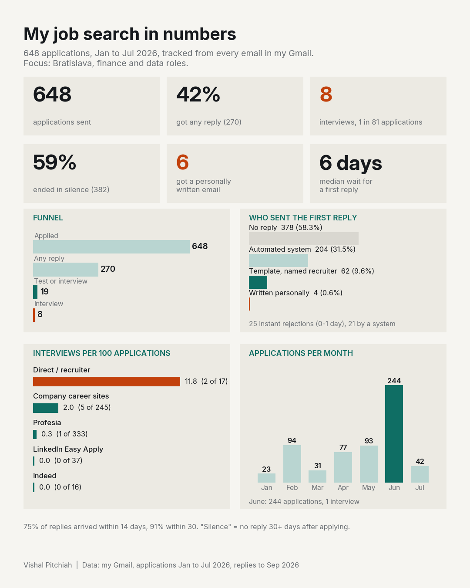

# Job Search Analysis: Slovakia 2026

I applied to 648 finance and data roles between January and July 2026, mostly in Bratislava. I pulled every job email from my Gmail, matched each confirmation, rejection, test and interview invite to its application, and compared the result with Slovak job market data from Profesia.sk.



## Key findings

**My applications (Jan to Jul 2026)**

| Outcome | Count | Share |
|---|---|---|
| Applications | 648 | 100% |
| Ghosted (no reply 30+ days) | 382 | 59% |
| Rejected | 264 | 41% |
| Reached a test or interview | 19 | 2.9% |
| Interviews | 8 | 1.2% (1 in 81) |

- Only 6 applications ever got an email written personally for me. First replies were mostly automated system emails (204) or standard templates (62).
- 25 rejections arrived the same or next day after applying, 21 from an automated system.
- Median wait for a first reply: 6 days. 75% of replies came within 14 days.
- Channel mattered more than volume: direct and recruiter contact gave 2 interviews from 17 applications; Profesia gave 1 from 333; LinkedIn Easy Apply and Indeed gave 0 from 53.
- June was the busiest month: 244 applications, 1 interview.

**The market (Jul 2025 to Jun 2026, estimates)**


- About 230,000 job postings in Slovakia; about 81,400 in the Bratislava region.
- About 7,700 finance and accounting postings in the Bratislava region (3.3% of all).
- Postings fell 16% in 2025 and 14% in H1 2026, while applications per posting rose from 29 to 36.
- Bratislava finance ads: 47% name English, 32% Slovak, 14% Czech, 8% German.
- Postings open to graduates fell from 36% (2019) to 29% (2025); about half of those still ask for experience.

## Repository

```
charts/   dashboard images
report/   13-slide PDF with every chart
data/     applications.csv (648 rows) and market.csv (inputs with sources)
src/      summary.py recomputes the headline numbers from the CSV
```

Run: `pip install -r requirements.txt && python src/summary.py`

## Method

1. Searched Gmail (Jan to Sep 2026) for application confirmations, rejections, tests, interview invites and recruiter emails.
2. Matched each email to one application (company + role) and merged duplicate confirmations.
3. Status: rejected, interview, withdrawn, or ghosted (no reply 30+ days after applying or after the last interview/test).
4. First reply sender: automated system email, standard template from a named recruiter, or written personally.
5. Market figures come from Profesia.sk reports; finance and language shares come from a live Profesia snapshot on 26 Sep 2026, so they are estimates. Graduate counts: Eurostat (2024, latest available).

Raw email exports, message links and recruiter names are not included, for privacy. A mandatory academic internship is excluded because it was not a job application.

## Sources

- Profesia 2025 annual report (Pravda, Jan 2026)
- Profesia H1 2026 report (TASR, Jul 2026)
- Alma Career, "Trh práce 2025 v dátach"
- TASR, graduates and experience analysis (Apr 2026)
- Alma Career, languages in job ads (Sep 2025)
- Eurostat, educ_uoe_grad02
